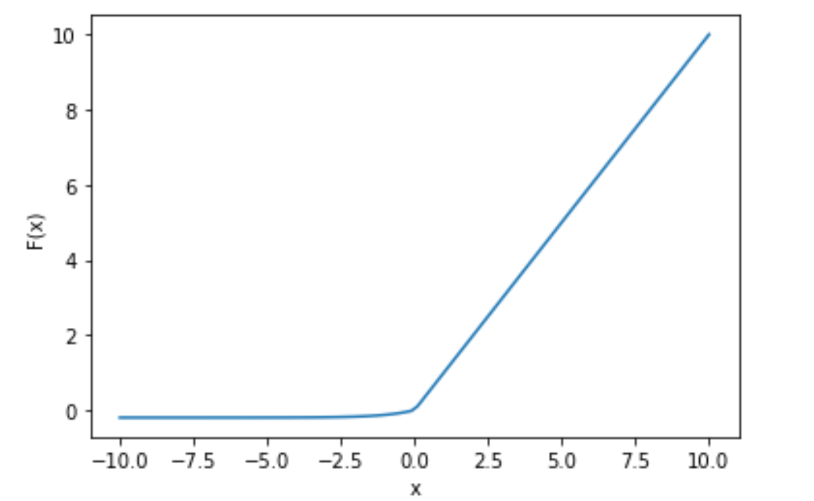

# ELU

Exponential Linear Unit

Activation function formula :   $f(x) =  x$                       $for        x>0$

                                                           $=  α.(e^x–1)x$      $for   x≤0$

Graph:

